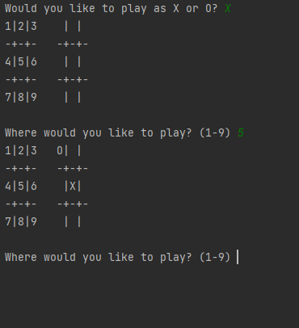

# Tic Tac Toe with Minimax

This project implements a command-line Tic Tac Toe game in Python, featuring a bot powered by the Minimax algorithm. Players can compete against the bot by choosing to play as either 'X' or 'O'. The bot intelligently evaluates all possible moves to make optimal decisions.

---

## Features
- **Minimax Algorithm**: The computer uses the Minimax algorithm to calculate the best possible move by simulating all outcomes.
- **No GUI Required**: Play directly in the terminal.
- **Customizable Gameplay**: Players can choose their side ('X' or 'O') before starting the game.

---

## Screenshot


---

## Purpose
This project showcases:
1. Implementing a terminal-based game in Python.
2. Using the Minimax algorithm for decision-making in turn-based games.
3. Practicing algorithms that evaluate game trees for optimal strategies.

---

## How to Play

### Prerequisites
- Python installed on your system.
- Numpy library (`pip install numpy`).

### Running the Game
1. Clone or download this repository.
2. Navigate to the project folder in your terminal.
3. Run the game using:
   ```bash
   python tic_tac_toe.py
   ```
4. Follow the prompts to choose your side ('X' or 'O') and play by entering numbers (1-9) corresponding to the board's positions.

### Example Board
The numeric board layout helps you pick your move:

```
1 | 2 | 3
-+-+-
4 | 5 | 6
-+-+-
7 | 8 | 9
```

After each move, the board updates to show the current game state.

---

## How It Works

### Minimax Algorithm
The bot uses the Minimax algorithm to evaluate the optimal move by:
1. Recursively exploring all possible moves from the current state.
2. Assigning scores to terminal states (win, lose, tie).
3. Choosing the move that maximizes its chances of winning (or minimizes losses if the player has the advantage).

This ensures the bot plays perfectly, making it a challenging opponent!

---

## Customization

### Adjusting the Scoring
Modify the `scores` dictionary to change how the bot evaluates terminal states:
```python
scores = {"X": 1, "O": -1, "tie": 0}
```

### Adding Features
Enhance the game by:
- Adding multiple difficulty levels (e.g., random moves for easier play).
- Extending the board to larger grid sizes (e.g., 4x4).

---

## Acknowledgments
- **Minimax Algorithm**: Inspired by classical AI techniques in game theory.
- **Numpy**: Used for efficient board representation and operations.

Enjoy playing against a perfect Tic Tac Toe bot!
